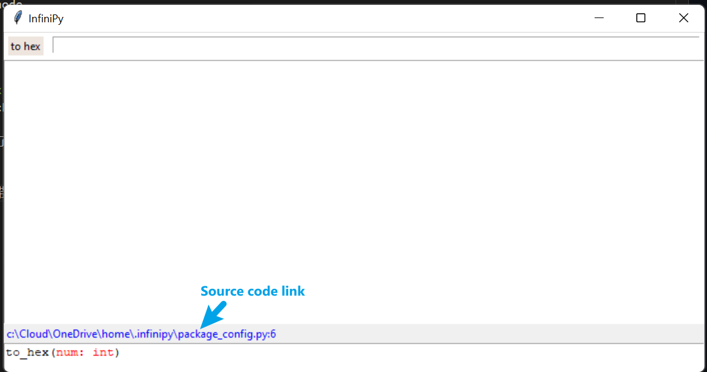
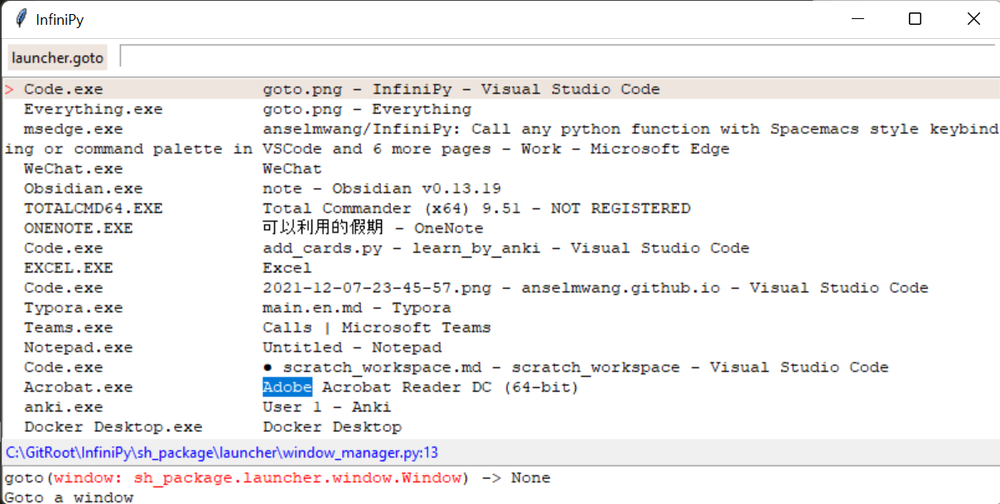

InfiniPy是一个类似于Wox的软件。在使用电脑时，我们经常想要通过快捷键迅速访问某些功能。比如一按快捷键就打开计算器，算完之后，一键关闭。或者一按快捷键就打开或者切换到某个应用程序。Wox具备强大的插件系统，因此，我们可以通过快捷键唤起Wox，然后完成各种任务。

那么InfiniPy相对于Wox等软件有哪些特点呢？
- 零门槛的扩展能力。如果您需要的功能在Wox中找不到，又不想学习复杂的插件编写，InfiniPy提供了零门槛的扩展能力，保证任何会写Python的人，不用学习任何概念，都能在1分钟内完成并开始使用自己的插件。这部分主要借鉴了emacs，极致简单的扩展。
- 最常用功能无需刻意记忆快捷键。InfiniPy受到spacemacs的启发，提供层级式菜单，每个菜单项用一个按键触发并显示下级菜单。不需要记忆任何快捷键，看着菜单用几次自然就熟悉了。忘了也能轻松通过菜单找到。
- 不常用功能也能轻松访问。不太常用的功能不值得占用快捷键，占用了也记不住。可以通过类似vscode的command palette来找到，不需要准确记忆，大概记得几个词就行。
- 自带的插件
	- 基于肌肉记忆的窗口切换插件。我日常使用的应用程序大概有10个，用alt tab或者鼠标切换总免不了用眼睛来找到应用程序。而我期待闭着眼睛也能切换。按下wb就切换到浏览器（w代表Windows，b代表浏览器），wo切换到Outlook，wd切换到vscode（d代表develop）。
	- 计算器。可以输入任何Python表达式。

# Quick Link
- [Quick Link](#quick-link)
- [插件开发](#插件开发)
  - [基础开发](#基础开发)
  - [配置Spacekey](#配置spacekey)
  - [开发更强大的插件](#开发更强大的插件)
- [常用插件](#常用插件)
- [安装](#安装)

# 插件开发

## 基础开发
下面的动画展示了如何开发to_hex插件（将十进制数转化为十六进制数）。总时间小于1分钟。

在这个动画中，和InfiniPy
相关的知识只有几个快捷键
- Capslock启动InfiniPy
- Dp打开插件开发环境
- Alt-Capslock重启InfiniPy
- 上下键或Ctrl-j、Ctrl-k用来在智能提示中上下移动，Tab或Enter用来选择，Enter还用于执行命令。

除此之外，开发者写的代码完全不用考虑InfiniPy。

## 配置Spacekey

在结束前一小节的开发后，我们已经能够通过command palette来调用to_hex插件了。但是如果这个插件特别常用，我们可以给它指定一个Spacekey binding，从而更快的调用它。具体方法是：
- 用Capslock启动InfiniPy
- Ds打开space_key_config.py
- 文件中默认包含下面的代码
```python
from space_key import SpaceKeyNode
from app_common import Leaf, add_space_key_children, walk_space_key_tree
from space_key_config_default import root_node
from package_config import *
```
- 加上一行
```python
# bind key sequence "ch" to function to_hex
walk_space_key_tree(root_node, ["c"]).add_child(Leaf("h", "Convert number to hex", to_hex))
```
- 现在可以用Capslock, c, h来触发`to_hex`函数了

## 开发更强大的插件
想要了解更多插件开发的知识，我们可以参考系统自带的插件。InfiniPy的command palette能够帮助我们找到插件的源码。如下图所示。点击Source code link可以直接用vscode打开相应的代码。


下面是Calculator(fun.calc)的代码
```python
from math import *

def calc(expr):
    return eval(expr)
```

Goto to a wndow(`launcher.goto`)允许我们切换到一个窗口，调用这个函数后，InfiniPy将会列出所有窗口，如下图所示。这本质上是通过intellisense实现的。具体实现方法请参考`launcher.goto`的代码。

# 常用插件


普通用户也录制两个视频

- 确定性的窗口切换和其他shortcut切换
    解释窗口切换
    - 一个图片解释普通窗口
    - 一个图片解释多个窗口情况
    - 一个图片解释直接搜索情况
    - 解释配置 
      - 一个图片找到窗口的exe文件名
      - 一个图片解释配置方法
    
    用少量文件解释其他shortcut切换

    一个视频解释配置windows方法
    shortcut切换其
- calculator

如果您感兴趣窗口切换的功能，参考这个链接

# 安装